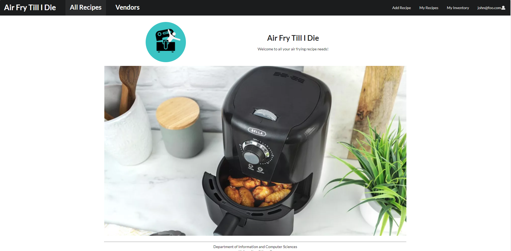
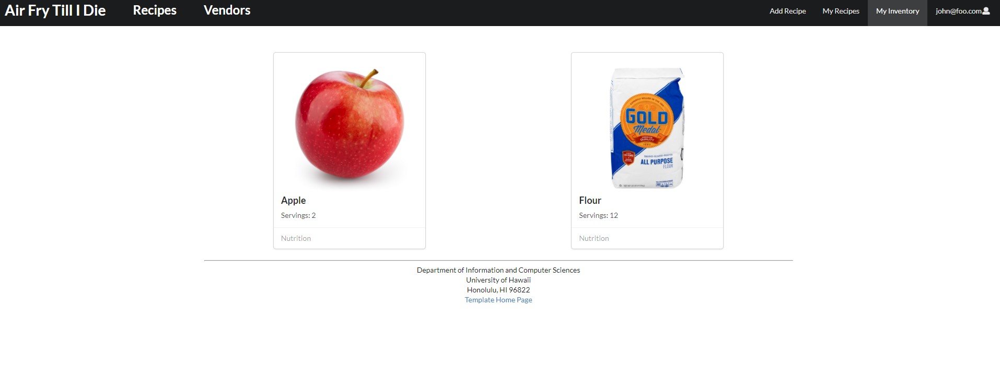
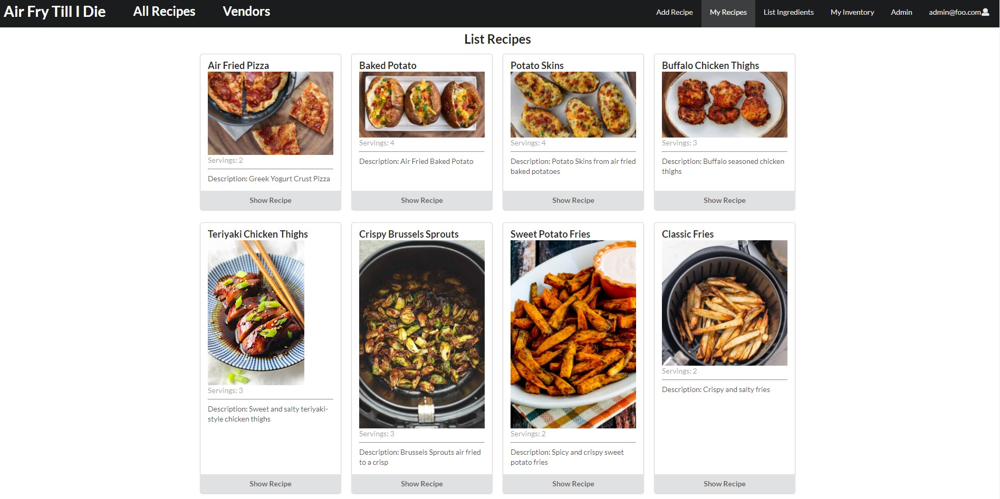
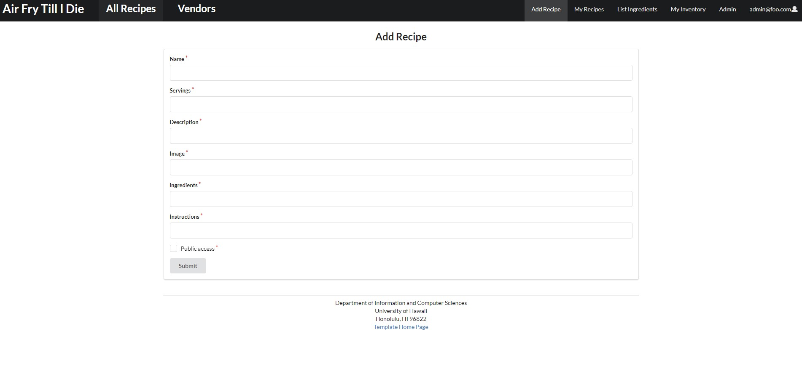
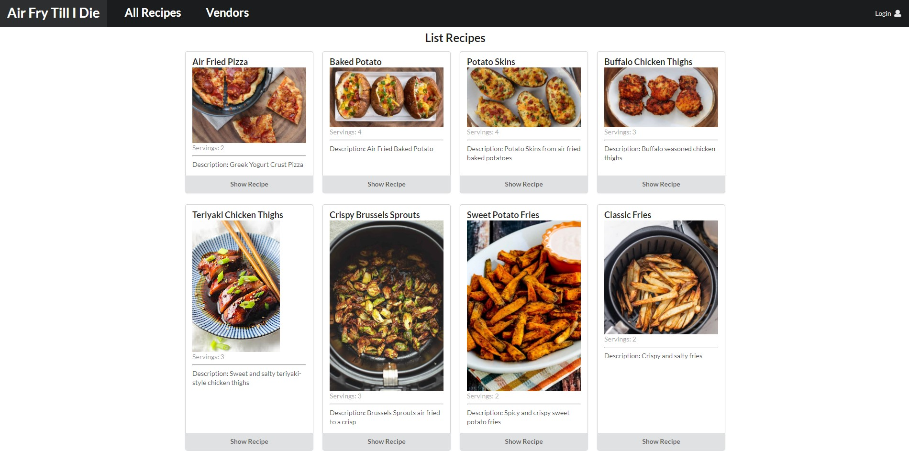
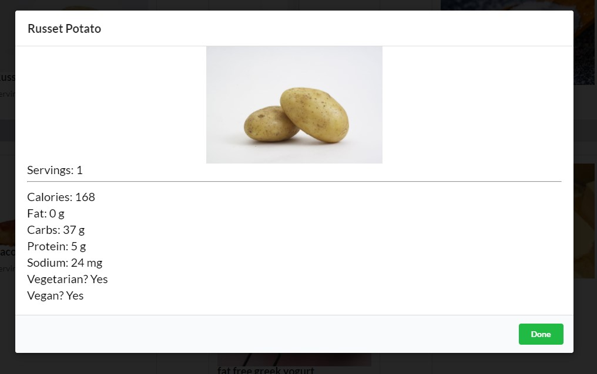
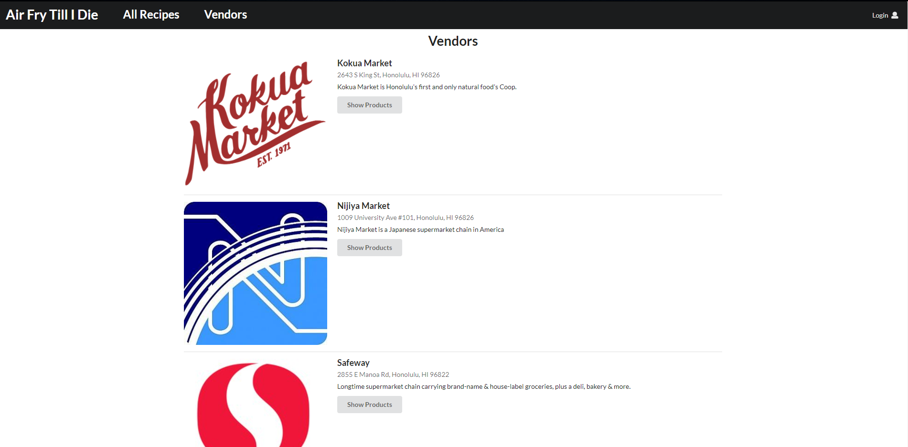
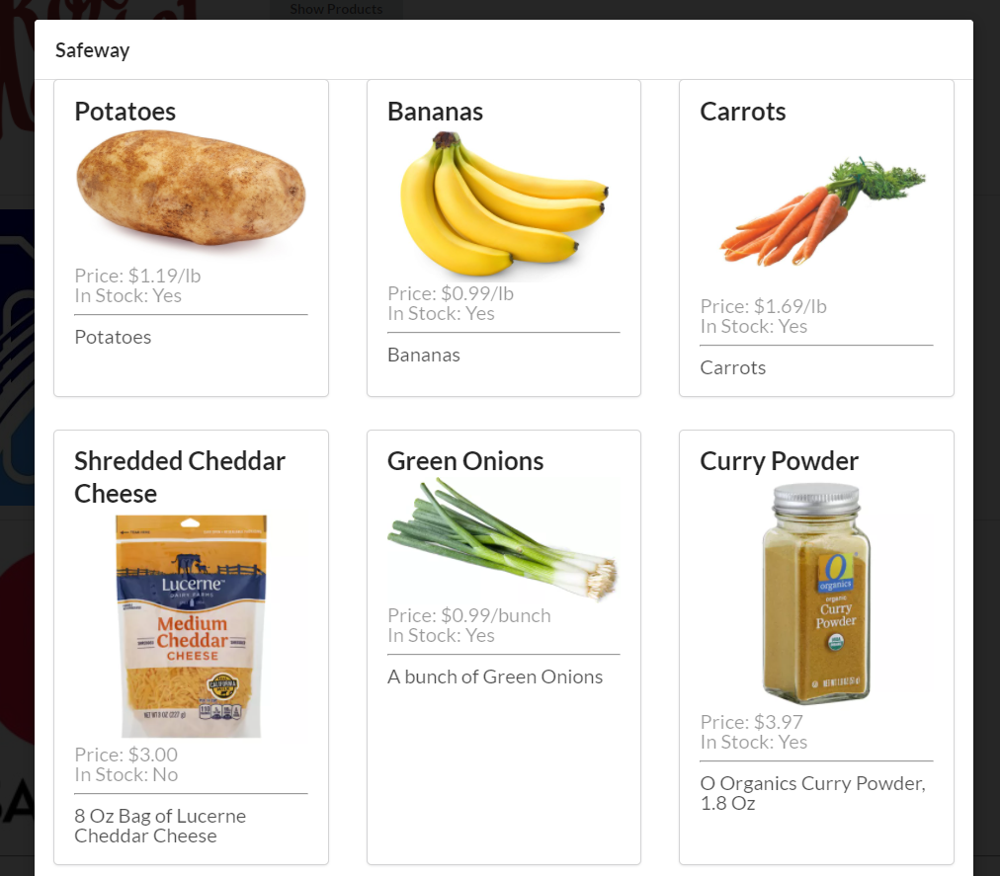

## Table of contents
* [Important Links](#important-links)
* [Overview](#overview)
* [Community Feedback](#community-feedback)
* [Recipes](#recipes)
* [Stores](#stores)
* [User Guide](#user-guide)
* [Developer Guide](#developer-guide)
* [Team](#team)
* [Pages](#pages)
* [Milestones](#milestones)

## Important Links
Check out our [source code!](https://github.com/Air-Fry-Till-I-Die/Air-Fry-Till-I-Die)


Check out our website: [aftid.xyz](https://aftid.xyz/#/)

Check out our Milestone [ 1 ](https://github.com/Air-Fry-Till-I-Die/Air-Fry-Till-I-Die/projects/1)[ 2 ](https://github.com/Air-Fry-Till-I-Die/Air-Fry-Till-I-Die/projects/2)[ 3 ](https://github.com/Air-Fry-Till-I-Die/Air-Fry-Till-I-Die/projects/3)!

## Overview

As college students move out on their own, it may be challenging for some to find ways to cook fast and convenient meals, which saves money over ordering expensive restaurant food and unhealthy fast food. Fortunately, there is a kitchen appliance quickly gaining popularity which can be a game-changer for the novice chef: the air fryer

An air fryer offers an extremely easy way to make food quickly while reducing mess and calories. It is a great way to make easy student-freindly staples like fries, chicken nuggets, or other crispy favorites while also reducing risk of fires by forgetful students preoccupied with studying and homework. It offers the speed and convenience of being able to drop in some food, turn on a timer, and being able to safely walk away that a microwave offers, while not sacrificing texture and flavor, and at a similar price point.

In addition to being able to make crispy frozen food items, air fryers can be used to easily prepare a number of simple recipes made from quality ingredients that would normally require a full oven or stove top and only take up a small amount of space in a dorm room or small apartment kitchen, making them ideal for students. Curated on this site are some simple recipes that a novice cook can prepare in a few minutes from a small handful of ingredients at a reasonable price, along with resources for where to find these ingredients. 

## Community Feedback

We've asked several students to visit our website and give us their thoughts on it. This is what they thought of it.
* A neat website to see what food is available to them with a air fryer
* A good variety of recipes
* Easy to browse and view nutritional facts
* Wish there was a way to add their own ingredients and recipes
We hope to fix some issues that these students have pointed out in the future!

## Recipes

We will be finding recipes to encompass a variety of dietary restrictions (i.e., Keto, Vegan, etc), as well as options for options to swap ingredients to modify recipes to fit such requirements

## Stores

We will also be including a list of stores along with ingredients they offer, and the pricing for the ingredients

### User Guide

## Pages

* [Landing page](#landing-page)
* [User inventory page](#user-inventory-page)
* [User recipes page](#user-recipes-page)
* [All recipes page](#all-recipes-page)
* [Nutritions page](#nutritions-page)
* [Vendors page](#vendors-page)


### Landing page
The landing page provides an aesthetic overview of the site. We will eventually add more descriptions of the site's features to the landing page which explains the functions of the pages and the benefits of creating an account

[Go to Landing page.](https://aftid.xyz/)

### User inventory page
The user inventory page lists all of the ingredients that a user owns. It lists each ingredient as a card, and has a link which directs the user to the ingredient's nutrition page. Currently, it has no way of adding new ingredients to the inventory, this will be implemented once we get the vendor page going.

[Go to Inventory page.](https://aftid.xyz/#/inventory) (must be logged in, currently unable to add but shows some default items)

### User recipes page
The User recipe page lists the user's created recipes. With each recipe card, a button to display the recipe is shown at the bottom of the card. Clicking it will give you more details about that recipe, such as the amount of ingredients need and the instructions to cook it.

[Go to Recipes page.](https://aftid.xyz/#/list) (must be logged in)

### Add recipes page
The add recipe page allows a user to add their own recipe. The user is able to define if they want their recipe to be publicly available, meaning it would show up on the All Recipes page, free for anyone to see.

[Go to Add Recipes page.](https://aftid.xyz/#/add) (must be logged in)

### All recipes page
This will show all available recipes that are created by the users of the website.

[Go to All Recipes page.](https://aftid.xyz/#/all-recipes)

### Nutritions page
Previously, the nutritions fact was displayed on a separate page. However, we found that it would make more sense if the nutrition facts for a given item would display without moving pages, allowing the user to easily view each ingredient's nutritional info without losing their place on the list that they are viewing.


### Vendors page
The Vendors page will display shops close to UH Manoa, as well as provide addresses and links to their respective websites. Each vendor will have a products modal, which will show the various products each vendor may have, as long as an image, price, in stock, etc.




### Developer Guide
In order to run this website on your own server, follow the instructions below.

First, [install meteor.](https://www.meteor.com/install)

Next, go to the source code of Air Fry Till I Die via the [github page](https://github.com/Air-Fry-Till-I-Die/Air-Fry-Till-I-Die). Once your at the projects homepage, click the green Code button, and download ZIP. Once downloaded, extract it to the directory of your choice.

Then, using a terminal or something similar, move to the directory to which you've extracted the files. Use the following command to install the libraries:
```
$ meteor npm install
```

And lastly, run the website with:

```
$ meteor npm run start
```

If everything goes well, the website will appear at [http://localhost:3000](http://localhost:3000).


## Milestones

### M1

Our finished Milestone 1 can be found [here](https://github.com/Air-Fry-Till-I-Die/Air-Fry-Till-I-Die/projects/1).

### M2

Our finished Milestone 2 can be found [here](https://github.com/Air-Fry-Till-I-Die/Air-Fry-Till-I-Die/projects/2).

### M3

And our Milestone 3 is finally completed can be found [here](https://github.com/Air-Fry-Till-I-Die/Air-Fry-Till-I-Die/projects/3).

## Team

Our team consists of: 
* Thomas Yang - Computer Engineering Major
* Alvin Yang - Computer Engineering Major
* Jared Taylor - Computer Science Major
