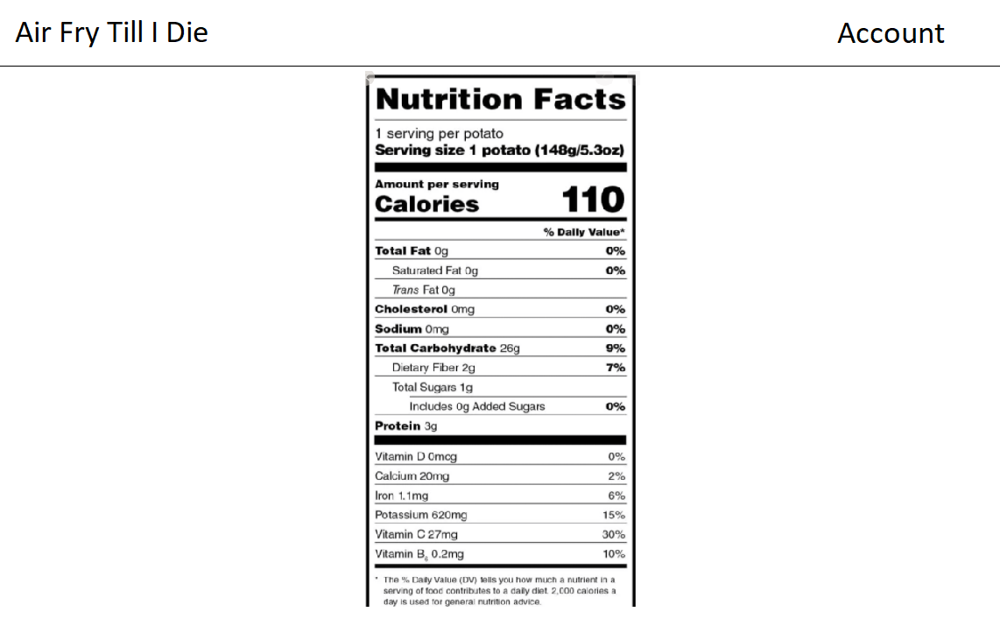
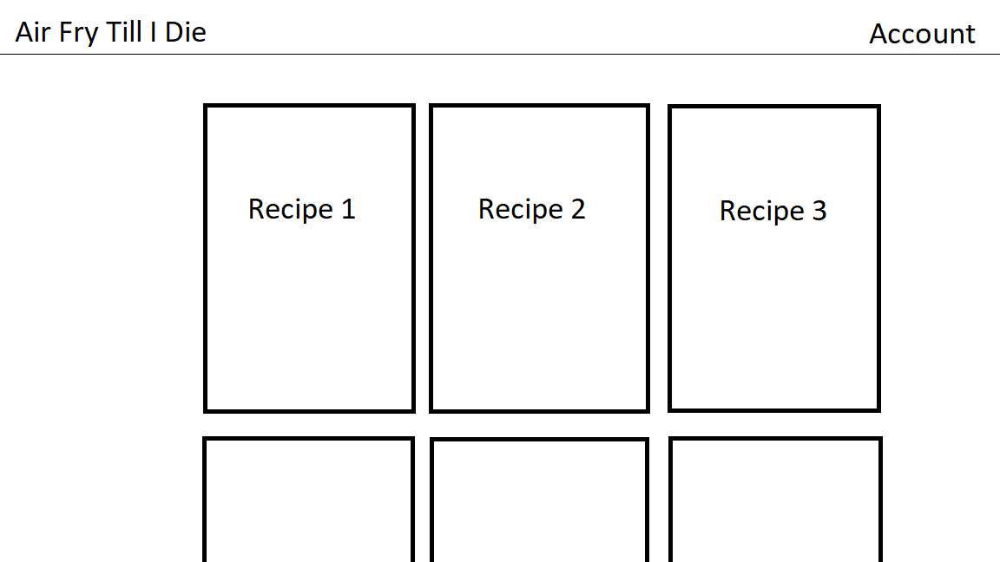
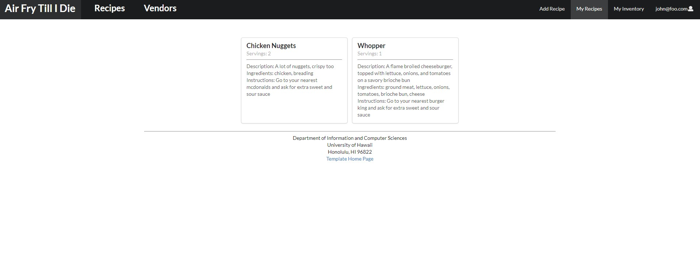
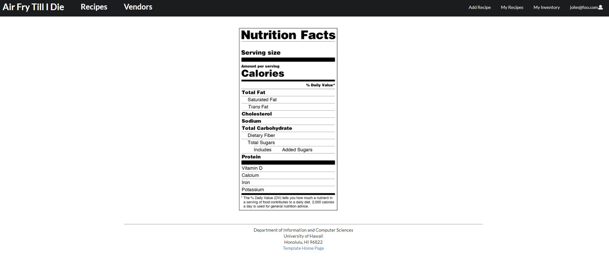

## Table of contents

* [Overview](#overview)
* [Recipes](#recipes)
* [Stores](#stores)
* [Team](#team)

## Overview

As college students move out on their own, it may be challenging for some to find ways to cook fast and convenient meals, which saves money over ordering expensive restaurant food and unhealthy fast food. Fortunately, there is a kitchen appliance quickly gaining popularity which can be a game-changer for the novice chef: the air fryer

An air fryer offers an extremely easy way to make food quickly while reducing mess and calories. It is a great way to make easy student-freindly staples like fries, chicken nuggets, or other crispy favorites while also reducing risk of fires by forgetful students preoccupied with studying and homework. It offers the speed and convenience of being able to drop in some food, turn on a timer, and being able to safely walk away that a microwave offers, while not sacrificing texture and flavor, and at a similar price point.

In addition to being able to make crispy frozen food items, air fryers can be used to easily prepare a number of simple recipes made from quality ingredients that would normally require a full oven or stove top and only take up a small amount of space in a dorm room or small apartment kitchen, making them ideal for students. Curated on this site are some simple recipes that a novice cook can prepare in a few minutes from a small handful of ingredients at a reasonable price, along with resources for where to find these ingredients. 

## Recipes

We will be finding recipes to encompass a variety of dietary restrictions (i.e., Keto, Vegan, etc), as well as options for options to swap ingredients to modify recipes to fit such requirements

## Stores

We will also be including a list of stores along with ingredients they offer, and the pricing for the ingredients

## Team

Our team consists of: 
Thomas Yang - Computer Engineering Major
Alvin Yang - Computer Engineering Major
Jared Taylor - Computer Science Major

## Mockups

## Pages

* [Landing page](#landing-page)
* [User inventory page](#user-inventory-page)
* [User recipes page](#user-recipes-page)
* [All recipes page](#all-recipes-page)
* [Nutritions page](#nutritions-page)

### Landing page

[Go to landing page.](http://159.89.54.201/)

### User inventory page

### User recipes page
The User recipe page lists the user's created recipes. The recipe card needs improvement, and a feature is being considered to bring the user to a new site which displays the recipe instead of just on the card.

### Add recipes page
The add recipe page allows a user to add their own recipe. The public feature still needs to be implemented correctly, and server defined ingredients are to be added in the future.

### Nutritions page
Currently, the nutritions page will show the nutrition of the ingredient that lead to it, but is not connected to any databases.

## Milestones

### M1

Our finished Milestone 1 can be found [here](https://github.com/Air-Fry-Till-I-Die/Air-Fry-Till-I-Die/projects/1).

### M2

And our Milestone 2 is currently in progress and can be found [here](https://github.com/Air-Fry-Till-I-Die/Air-Fry-Till-I-Die/projects/2).
